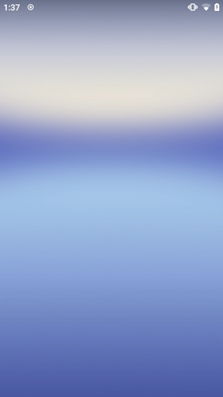
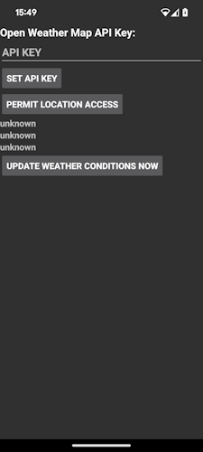
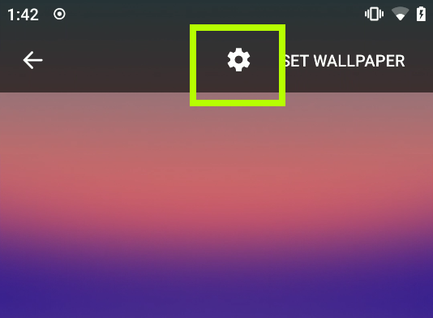

marlin-qp1a.191005.007.a3-factory-bef66533.zip

### What is it?

This project provides fixes for closed-source
live wallpaper from original gogle pixel
smartphone

### How to build?

There is no source code, so you should generate
one by yourself

- Download APK file
  from [APKMirror link](https://www.apkmirror.com/apk/google-inc/google-live-data-wallpapers/google-live-data-wallpapers-10-release/google-live-data-wallpapers-10-android-apk-download/
  )
- Check MD5 hash, Should
  be `5A57E2B6620F296F7C7BE015E0A20B0F`
- Place APK file into `decompiler` folder
- Execute `decompile.bat`
- Wait for process to finish. Success message
  looks like
    ```
  Finished! 
    Now you can import project to IDE
    Window may be safely closed
  ```
- Now, project can be imported from IDE to build
  APK file by yourself

### Screenshots




### What was changed

- Fixel Weather API. Now uses OpenWeather instead of dead Awareness API
- Bumped target SDK to 34
- Implemented settings gui



### How to find Settings?


